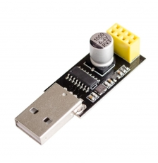
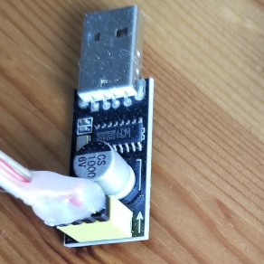
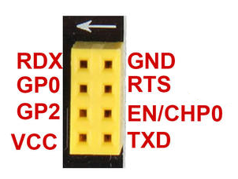
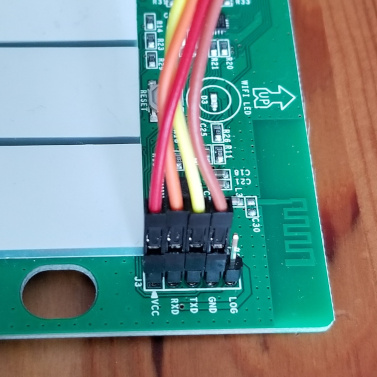

# home-assistant-config
My Home Assistant (https://home-assistant.io) configuration

## Controlled devices and sensors

* [Home Wizard](https://homewizard.com/) to get temperature and humidity from [iROX HTS55](http://www.irox.com/fr/produits/accessoires/hts55.htm) RF Sensors and to get data about electric power consumption from [Wattcher](https://www.wattcher.nl/en/) using the HomeAssistant [comand line sensor](https://www.home-assistant.io/components/sensor.command_line/) and [RESTful sensor](https://www.home-assistant.io/components/sensor.rest/)
* [Music Player Daemon](https://www.musicpd.org/) with [HomeAssistant MPD Component](https://www.home-assistant.io/components/media_player.mpd/) to control the music in shower and bath rooms
* Remote Control the TV's of our Family (Philips Android TV 2016+) with a [Custom HomeAssistant Component](https://github.com/nstrelow/ha_philips_2016)
* Remote Control [Kodi](https://kodi.tv/) which is running on [LibreELEC](https://libreelec.tv/) on Raspberry Pi with [HomeAssistant Kodi Component](https://www.home-assistant.io/components/media_player.kodi/)
* iRobot [Roomba 980](https://shop.irobot.de/roomba-staubs-staubsaugerroboter-roomba-980/R980040.html) with [HomeAssistant Roomba Vacuum Cleanter Component](https://www.home-assistant.io/components/vacuum.roomba/)
* Philips [Hue Bridge](https://www2.meethue.com/en-us/p/hue-bridge/046677458478) and Lamps with the [HomeAssistant Hue Component](https://www.home-assistant.io/components/hue/) 
* Ikea [Tradfri Gateway](https://www.ikea.com/us/en/catalog/products/00337813/) and Lights with the [HomeAssistant Tradfri Component](https://www.home-assistant.io/components/tradfri/) 
* myStrom [WiFi Button](https://mystrom.ch/wifi-button/) using the [HomeAssistant myStrom binary sensor](https://www.home-assistant.io/components/binary_sensor.mystrom/) to remote control the Light in my room
* Broadlink [RM Mini 3 Wi-Fi Universal Remote](http://www.ibroadlink.com/rmMini3/) using the HomeAssistant [Broadlink RM Switch Component](https://www.home-assistant.io/components/switch.broadlink/) for controlling Westinghouse [Monarch Trio](https://www.lampenwelt.ch/westinghouse-monarch-trio-ventilator.html) Lights and Ventillators and [OSRAM Color LED Lamps](https://www.osram.com/)
* [Sonoff](https://sonoff.in/) [WiFi Smart Switch](https://www.sonoff.in/index.php?route=product/product&product_id=79) for AC- TH16 Temperature and Humidity Monitoring and Heating Control in Shower and Bathroom using the HomeAssistant [MQTT Switch](https://www.home-assistant.io/components/switch.mqtt/) and [MQTT Sensor](https://www.home-assistant.io/components/sensor.mqtt/)
* [Sonoff](https://sonoff.in/) [WIFI Smart Switch Basic](https://www.sonoff.in/index.php?route=product/product&product_id=75) for Light Switching
* [Sonoff](https://sonoff.in/) [WIFI Smart Touch Panel Switch](https://www.sonoff.in/index.php?route=product/product&product_id=73) for manual and automatic switching and remote control
* all Sonoff Devices are set up with [Tasmota](https://github.com/arendst/Sonoff-Tasmota) firmware
* [FRITZ!Box 5490](https://ch.avm.de/produkte/fritzbox/fritzbox-5490/) Router and HomeAssistant [Fritz!Box component](https://www.home-assistant.io/components/device_tracker.fritz/) for presence detection in my flat and the HomeAssistant [FRITZ!Box Net Monitor](https://www.home-assistant.io/components/sensor.fritzbox_netmonitor/) for network statistics
* [Dacota Platinum Travel Router](https://www.power.no/data-og-tilbehoer/nettverk-og-rutere/router/dacota-p-travel-router/p-253786/) for presence detection in parents flat with the [HomeAssistant Scrape Sensor](https://www.home-assistant.io/components/sensor.scrape/)
* [HomeAssistant nmap tracker](https://www.home-assistant.io/components/device_tracker.nmap_tracker/) for presence detection
* Wireless Network Camera [DCS-820L](https://eu.dlink.com/uk/en/products/dcs-820l-wifi-baby-camera) using the [HomeAssistant Generic Camera Component](https://www.home-assistant.io/components/camera.generic/)
* Wireless Network Camera [DCS-930L](https://eu.dlink.com/uk/en/products/dcs-930l-wireless-n-network-camera)
* Currency tracking with the [HomeAssistant Alpha Vantage Component](https://www.home-assistant.io/components/sensor.alpha_vantage/)
* Weather-Maps from [Meteogroup](https://www.meteogroup.com)
* Yahoo-Weather using the [HomeAssistant Yahoo Weather Component](https://www.home-assistant.io/components/weather.yweather/)
* Darksky-Weather using the [HomeAssistant Dark Sky Component](https://www.home-assistant.io/components/weather.darksky/)
* many Webcams to see the weather in lovely places of switzerland using the [HomeAssistant Generic Camera Component](https://www.home-assistant.io/components/camera.generic/)
* some Website Scrapers to get information about sea level and water temperature
* **NEW** Mail to RSS gateway with [IMAP Sensor](https://www.home-assistant.io/components/sensor.imap_email_content/) and [RSS Feed Template](https://www.home-assistant.io/components/rss_feed_template/)

## Sonoff Configuration / Firmware
You can find the sonoff switches on [AliExpress](https://www.aliexpress.com/).

I flashed my switches with the [Sonoff-Tasmota](https://github.com/arendst/Sonoff-Tasmota) firmware using [esptool](https://github.com/arendst/Sonoff-Tasmota/wiki/Esptool) and an USB-Serial Converter with the well known CH340 Chip from [hobby-elektronik.ch](https://hobby-elektronik.ch/ESP8266-ESP8285-ESP32/ESP8266-Zubehoer/USB-zu-Seriell-Adapter-fuer-ESP8266-ESP-01::348.html).

For the cable, see these pictures:

### USB-Serial converter

### Sonoff Board

### Flashing
You can find the firmware for your Sonoff Device on the github page of Sonoff-Tasmota. See [here](https://github.com/arendst/Sonoff-Tasmota/wiki/Esptool#download-sonoff-tasmota) how to download and flash the image.

[@olibrian](https://github.com/olibrian/) sent me these step by step instructions:
      
      
      # Installation
      pip install esptool
      
      # Authorization for users
      sudo usermod -a -G dialout <USERNAME>
      
      # Backup of the current firmware
      esptool.py -p /dev/ttyUSB0 read_flash 0x00000 0x100000 image1M.bin
      
      # Delete firmware
      esptool.py -p /dev/ttyUSB0 erase_flash
      
      # Upload new firmware
      esptool.py -p /dev/ttyUSB0 write_flash --flash_size 1MB --flash_mode dout 0x00000 sonoff-basic.bin 

## History
### older Release

i moved to a new flat in the meantime and many things changed. The old release is available in this [branch](https://github.com/mgafner/home-assistant-config/tree/Release1)

### Home Automation controls Clementine Music Player

i was using my [Clementine Remote Bash Script](https://github.com/mgafner/clementine-remote-bash) to control the Clementine Music Player from Home Assistant.
See the working configuration with clementine in this [branch](https://github.com/mgafner/home-assistant-config/tree/clementine)

