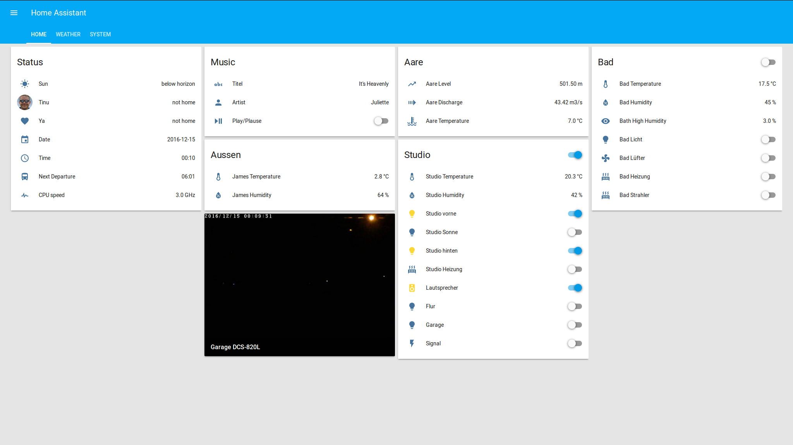

# home-assistant-config
My Home Assistant (https://home-assistant.io) configuration

## Controlled devices

* [Home Wizard](https://homewizard.com/)
* [Music Player Daemon](https://www.musicpd.org/)

## What's special?

### Home Automation controls Home Automation

in the switches and sensors sections i am using my [homewizard bash script](https://github.com/mgafner/homewizard-web-remote) to remote control my homewizard.

Update: for the moment i am not using homewizard. To see the working configuration with homewizard see the [branch](https://github.com/mgafner/home-assistant-config/tree/clementine)

### Home Automation controls Music Player Daemon

i am using my [MPD Remote Bash Script](https://github.com/mgafner/mpd-remote-bash) to control the Music Player Daemon from Home Assistant.

## Screenshots
(needs an update)

## History

this setups i am not using anymore:

### Home Automation controls Clementine Music Player

i was using my [Clementine Remote Bash Script](https://github.com/mgafner/clementine-remote-bash) to control the Clementine Music Player from Home Assistant.
See the working configuration with clementine in this [branch](https://github.com/mgafner/home-assistant-config/tree/clementine)

